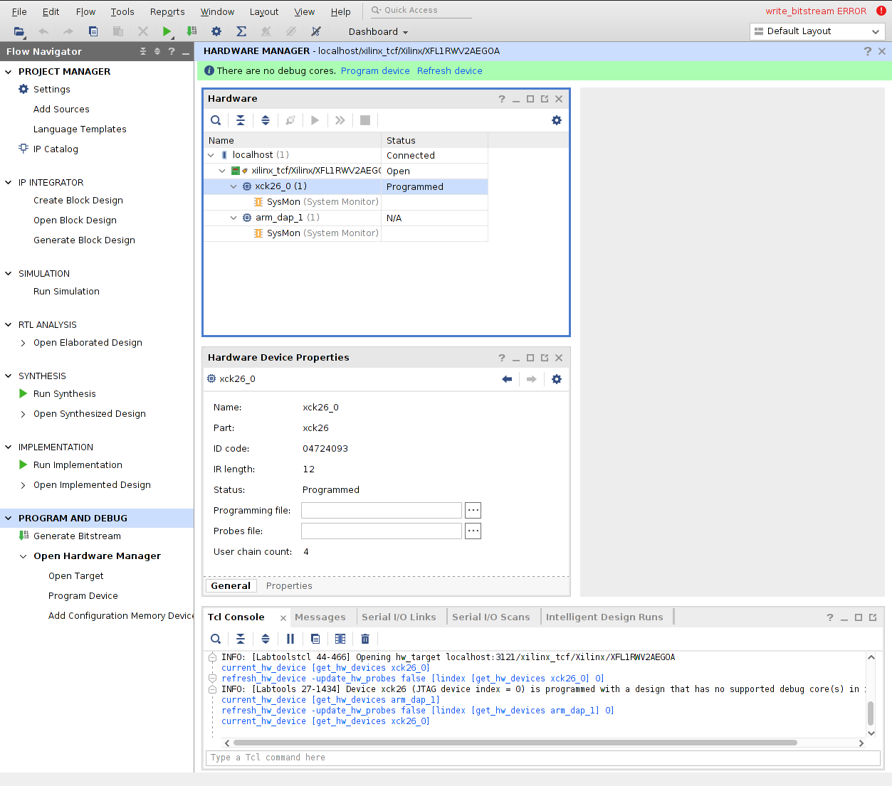

# KV260 Bringup

# Vivado Installation

* Download installer: `Xilinx_Unified_2021.1_0610_2318_Lin64.bin`
* Run installer and then download a local network drive image

    This makes it easier to install on multiple PCs later...

* For Ubuntu 20.04, before running `./xsetup`, first do the following:

    `sudo ln -s /lib/x86_64-linux-gnu/libtinfo.so.6  /lib/x86_64-linux-gnu/libtinfo.so.5` 

    If you don't do this, the installer will fail at a later stage.

* run `./xsetup`
* Install Vitis: this includes Vivado!
* Install PetaLinux

# Activate USB JTAG Cable

 The KV260 board uses a quad FTDI [FT4232HL](https://ftdichip.com/products/ft4232hl/) chip, which is connected to the following:

* JTAG interface of the FPGA
* SOM UART
* STDP4320 UART
* MIO I2C  M24C64 EEPROM WC_B write control

`lsusb` shows the following vendor id and product ID:

```
Bus 001 Device 014: ID 0403:6011 Future Technology Devices International, Ltd FT4232H Quad HS USB-UART/FIFO IC
```

The UART part should just work without driver (at least it did for me), but you need to install the `udev` rules file
to enable JTAG control:

```sh
cd ~/tools/Xilinx/Vitis/2021.1/data/xicom/cable_drivers/lin64/install_script/install_drivers
sudo ./install_drivers
``` 

result:

```
INFO: Installing cable drivers.
INFO: Script name = ./install_drivers
INFO: HostName = zen
INFO: Current working dir = /home/tom/tools/Xilinx/Vitis/2021.1/data/xicom/cable_drivers/lin64/install_script/install_drivers
INFO: Kernel version = 5.8.0-59-generic.
INFO: Arch = x86_64.
Successfully installed Digilent Cable Drivers
--File /etc/udev/rules.d/52-xilinx-ftdi-usb.rules does not exist.
--File version of /etc/udev/rules.d/52-xilinx-ftdi-usb.rules = 0000.
--Updating rules file.
--File /etc/udev/rules.d/52-xilinx-pcusb.rules does not exist.
--File version of /etc/udev/rules.d/52-xilinx-pcusb.rules = 0000.
--Updating rules file.

INFO: Digilent Return code = 0
INFO: Xilinx Return code = 0
INFO: Xilinx FTDI Return code = 0
INFO: Return code = 0
INFO: Driver installation successful.
CRITICAL WARNING: Cable(s) on the system must be unplugged then plugged back in order for the driver scripts to update the cables.
```

See also [Xilinx installation manual](https://www.xilinx.com/support/documentation/sw_manuals/xilinx2020_2/ug973-vivado-release-notes-install-license.pdf#page=49).

As always, I had to reboot to make things stick after this...

* PROGRAM AND DEBUG
* Open Hardware Manager
* Open Target
* Auto Connect

Result:




# KV260

Features:
* FPGA part name: XCK26-SFVC784-2LV-C
    * Not directly supported in Vivado. Need to select a board instead of a part...
    * Close cousin of ZU5EV, however, when looking at the [ZU5EV pinout](https://www.xilinx.com/support/documentation/user_guides/ug1075-zynq-ultrascale-pkg-pinout.pdf#page=133),
      and compare it against the XCK26, there seem to be differences. 
      E.g. the ZU5EV has much more pins in bank 66.

* 4x Cortex A53 @ 1.5GHz
    * 256KB onchip memory, 1MB L2 cache
* 2x Cortex R5F @ 600MHz
    * 128KB TCM per CPU
* Mali-400 MP2 @ 667MHz
* Video Codec Unit

* 256K logic cells
* 144 Block RAM blocks
* 64 UltraRAM blocks
* 1248 DSP slices


* [Official Documentation](https://www.xilinx.com/products/som/kria/kv260-vision-starter-kit.html#documentation)
* [Motherboard Schematic](https://www.xilinx.com/member/forms/download/design-license.html?cid=3eb7e365-5378-461f-b8b0-bb3dad84eb4e&filename=xtp682-kria-k26-carrier-card-schematic.zip)
* [Kria K26 SOM Wiki](https://xilinx-wiki.atlassian.net/wiki/spaces/A/pages/1641152513/Kria+K26+SOM)

* [Kria SOM Carrier Card - Design Guide](https://www.xilinx.com/support/documentation/user_guides/som/ug1091-carrier-card-design.pdf)
	
	* How to design a board that uses a Kria SOM.
	* Figure 1 is important because it shows which SOM pins are going where.

* [Kria K26 SOM Data Sheet](https://www.xilinx.com/support/documentation/data_sheets/ds987-k26-som.pdf)

	* Quite a bit of overlap with the SOM Carrier Card Design Guide.

* [Kria KV260 Vision AI Starter Kit DataSheet](https://www.xilinx.com/support/documentation/data_sheets/ds986-kv260-starter-kit.pdf)

	*  Low of useful info.

* [Kria KV260 Vision AI Starter Kit User Guide](https://www.xilinx.com/support/documentation/user_guides/som/1_0/ug1089-kv260-starter-kit.pdf)

	* Describes connectors, boot devices and firmware, getting started info, tools integration overview, board reset and firmware update/recovery.
	

* Download petalinux image from [this getting started link](https://www.xilinx.com/products/som/kria/kv260-vision-starter-kit/kv260-getting-started/setting-up-the-sd-card-image.html), 
  not from [this one](https://xilinx.github.io/kria-apps-docs/docs/smartcamera/smartcamera_landing.html).
* Once the initial getting started is up and running, then use the command line options of the github smartcamera page.
	* E.g. try with different resolution, try with rtsp -> VLC


* [KV260 Vitis - Design Examples Repo](https://github.com/Xilinx/kv260-vitis)

	* [Board Files](https://github.com/Xilinx/kv260-vitis/tree/release-2020.2.2_k26/platforms/vivado/board_files)

* [Zynq UltraScale+ MPSoC Product Selection Guide](https://www.xilinx.com/support/documentation/selection-guides/zynq-ultrascale-plus-product-selection-guide.pdf)

# SOM240 pinout to Starter Kit

* [`kv260_pinout.py`](./kv260_pinout.py) is a Python dict will all information gathered.

	* [`pin_process.py`](./pin_process.py) will use the pinout file to create all kinds of tables etc.

* Based on schematic: I went through all the SOM240_1 pins and derived their meaning.
* The [som240 board file](https://github.com/Xilinx/kv260-vitis/blob/release-2020.2.2_k26/platforms/vivado/board_files/som240/1.0/board.xml#L280-L488)
  contains useful interface signal naming.
* [k26c part0_pins.xml](https://github.com/Xilinx/kv260-vitis/blob/release-2020.2.2_k26/platforms/vivado/board_files/k26c/1.0/part0_pins.xml) contains
  connector signal pin to FPGA pin mapping for some signals.
* The project XDC files also contains some [pin to signal mappings](https://github.com/Xilinx/kv260-vitis/blob/7be7a2a621ab6d414a30df59f4bf8988fde37b8e/platforms/vivado/kv260_ispMipiRx_vcu_DP/xdc/pin.xdc#L11-L78).


M2C: module to carrier board
C2M: carrier board to module

* IAS0 connector: OnSemi image access system (IAS) camera module interfacesupporting four MIPI lanes. 
  Connects to OnSemi AP1302 ISP device sensor 0 interface.
* IAS1 connector: OnSemi IAS camera module interface supporting four MIPI lanes.
* JTAG: when FTDI chip has `LS_OE_B` pin asserted then JTAG pins are driven. Otherwise, the JTAG connector can take over.

# Clock Architecture

* Derived from Vivado project (kv260_ispMipiRx_DP)
* Zynq UltraScale IP Block Clock Configuration: 
	Input Clocks: 

	* PSS_REF_CLK: 33.33MHz (generated on the SOM itself?)
	* SATA: Ref Clk2: 125MHz
	* Display Port: Ref Clk0: 27MHz
	* USB0: Ref Clk1: 26MHz
	* These Ref Clk speeds match the speeds of the clockgen in the KV260 schematic

	Output Clocks:
	* PL Fabric Clocks: PL0 to PL1 all set to 100MHz.
* Block Design:
	* PL0 clock -> Clocking Wizard IP block -> 5 clocks: clk200M, clk100M, clk300M, clk50M, clk600M
		


# Tutorial

* [Xilinx ZCU102 Tutorial](https://xilinx.github.io/Embedded-Design-Tutorials/master/docs/Introduction/ZynqMPSoC-EDT/README.html)

* [Zynq UltraScale+ Device - Technical Reference Manual](https://www.xilinx.com/support/documentation/user_guides/ug1085-zynq-ultrascale-trm.pdf)

    Required reading for better general understanding of how IOs are mapped etc.
